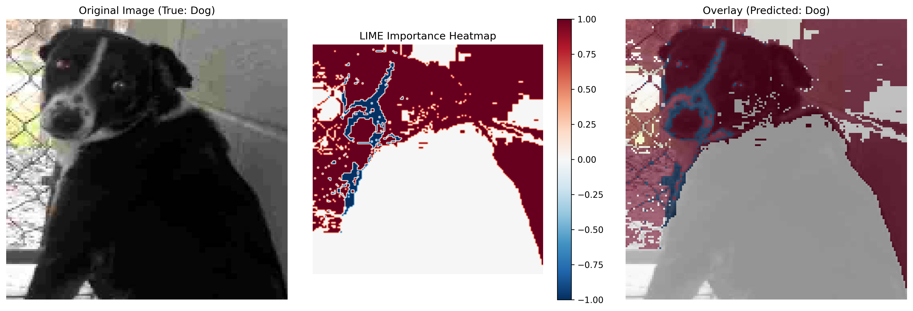

# lime_mnist_explainer
Explainable AI experiment with LIME on MNIST: seeing what the model sees.

## LIME 설명 예시

위 이미지는 LIME(Local Interpretable Model-agnostic Explanations)을 사용하여 모델의 예측을 설명한 결과입니다:

- 왼쪽: 원본 이미지
- 가운데: LIME 중요도 히트맵 (빨간색: 긍정적 영향, 파란색: 부정적 영향)
- 오른쪽: 원본 이미지와 중요도 히트맵의 오버레이

이 설명을 통해 모델이 이미지의 어떤 부분을 보고 예측을 내렸는지 시각적으로 확인할 수 있습니다.
